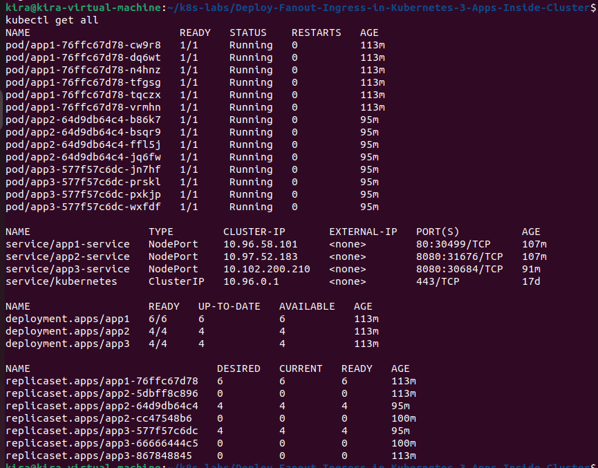
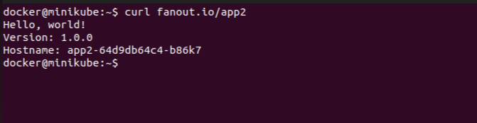
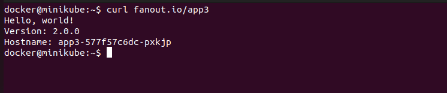

# Fanout Ingress Application Deployment on Kubernetes 

This guide explains how to deploy a 3 applications using Kubernetes, with multiple pods for scalability and deploy a fanout ingress.

## Prerequisites

Before deploying, ensure you have the following installed and configured:

- [Git](https://git-scm.com/)
- [kubectl](https://kubernetes.io/docs/tasks/tools/)
- A running Kubernetes cluster (e.g., Minikube, kind, or a cloud provider like GKE, EKS, AKS)


---

## Step 1: Deploy to Kubernetes

Apply the deployment and service configuration:

```bash
kubectl apply -f app1-deployment.yml
kubectl apply -f app1-service.yml
kubectl apply -f app2-deployment.yml
kubectl apply -f app2-service.yml
kubectl apply -f app3-deployment.yml
kubectl apply -f app3-service.yml

```

## Step 2: apply the Ingress Resource
```bash
kubectl apply -f fanout-ingress.yml
```

## Step 3: Verify the Deployment and Ingress 
Check if the pods, service and Ingress are running:

```bash
kubectl get all
```


---

## Step 4: Access the Applications
You can access the applications through the Ingress controller. The Ingress routes traffic to the different applications based on the path specified in the `fanout-ingress.yml` file.
For example, if you have set up the Ingress to route traffic as follows:
- `/` to `app1-service`
- `/app2` to `app2-service`
- `/app3` to `app3-service`
You can access them using the following URLs:
```bash
http://<ingress-ip>/
http://<ingress-ip>/app2
http://<ingress-ip>/app3
```
For Minikube users, you can get the Ingress IP by running:

```bash
minikube ssh
```
Then, inside the Minikube VM, run:
Replace `<<replace with your ingress IP>>` with the actual IP address of your Ingress 
controller. You can find this IP by running:

```bash
minikube ip
```

```bash
sudo /bin/sh -c 'echo "<<replace with your ingress IP>>  fanout.io" > /etc/hosts'
```

```bash
Then, you can access the applications using:

```bash
curl fanout.io/
curl fanout.io/app2
curl fanout.io/app3
```

--- 




---


---

## Clean Up

To delete all resources related to this deployment:

```bash
kubectl delete -f app1-deployment.yml
kubectl delete -f app1-service.yml
kubectl delete -f app2-deployment.yml
kubectl delete -f app2-service.yml
kubectl delete -f app3-deployment.yml
kubectl delete -f app3-service.yml
kubectl delete -f fanout-ingress.yml
```

---

## License

MIT License

