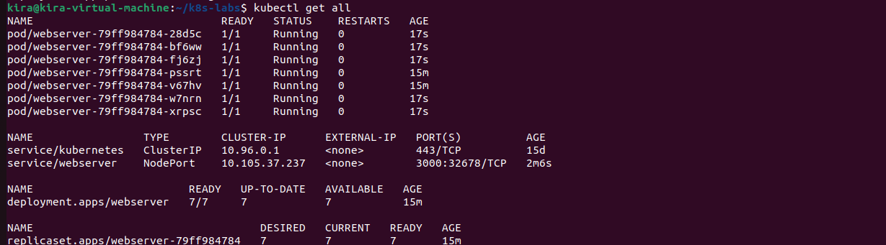
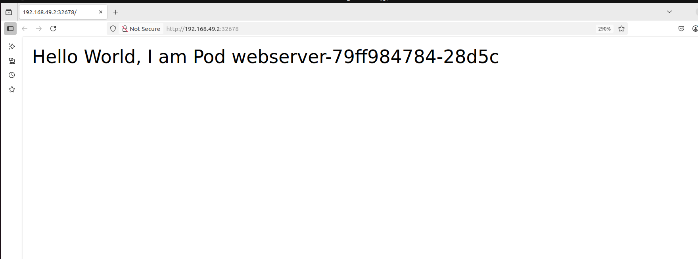
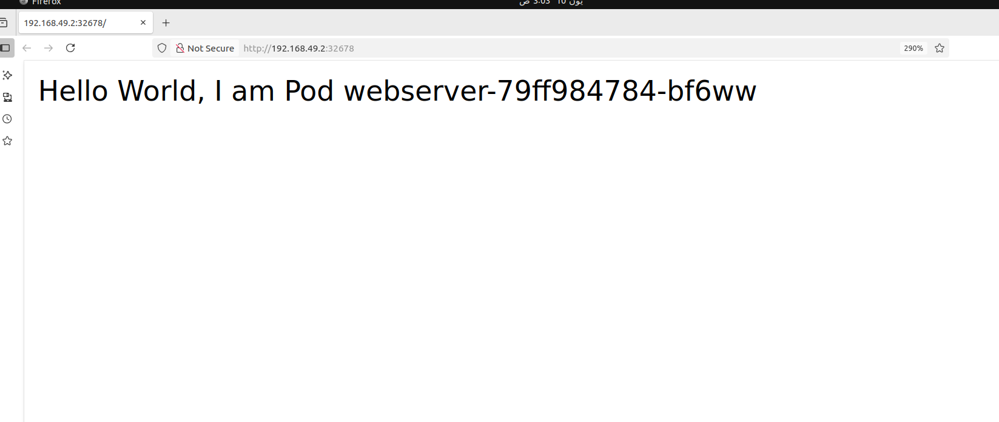

# Node.js Application Deployment on Kubernetes

This guide explains how to deploy a Node.js application using Kubernetes, with multiple pods for scalability.

## Prerequisites

Before deploying, ensure you have the following installed and configured:

- [Git](https://git-scm.com/)
- [kubectl](https://kubernetes.io/docs/tasks/tools/)
- A running Kubernetes cluster (e.g., Minikube, kind, or a cloud provider like GKE, EKS, AKS)

---

## Step 1: Clone the Repository

```bash
git clone https://github.com/emanzaki/Deploying-Nodejs-Application-in-Kubernetes
cd Deploying-Nodejs-Application-in-Kubernetes
```

---

## Step 2: Deploy to Kubernetes

Apply the deployment and service configuration:

```bash
kubectl apply -f deployment.yml

kubectl apply -f service.yml
```

## Step 3: Verify the Deployment

Check if the pods and service are running:

```bash
kubectl get all
```


---

## Step 4: Access the Application

Depending on how your service is configured (e.g., NodePort or LoadBalancer), you can access your Node.js app:

For Minikube users:

```bash
minikube service nodeapp-service
```
---




## Scaling the Application (Optional)

You can manually scale the number of pods:

```bash
kubectl scale deployment webserver --replicas=10
```


---

## Clean Up

To delete all resources related to this deployment:

```bash
kubectl delete -f deployment.yml
```

---

## License

MIT License

